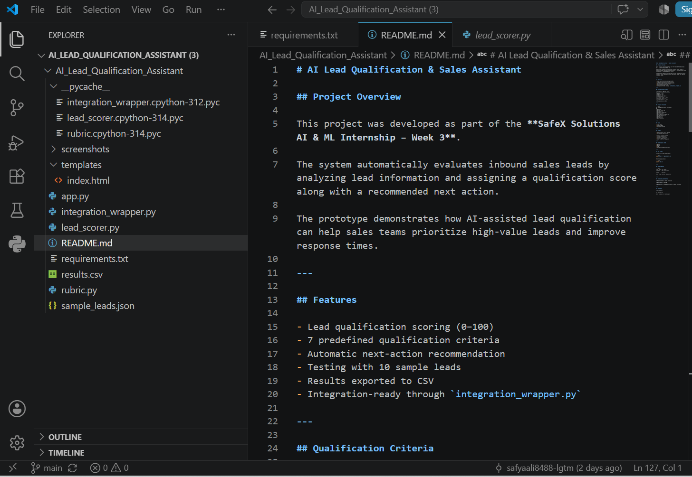
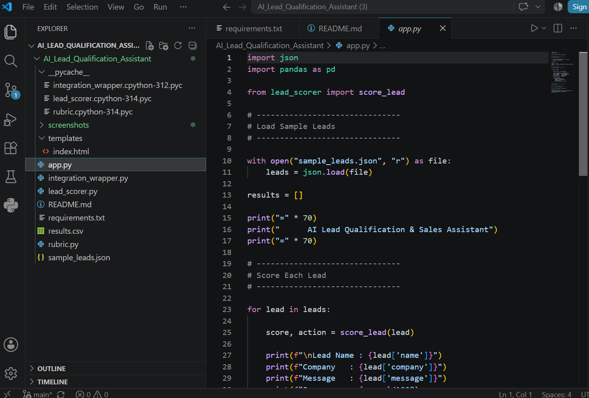
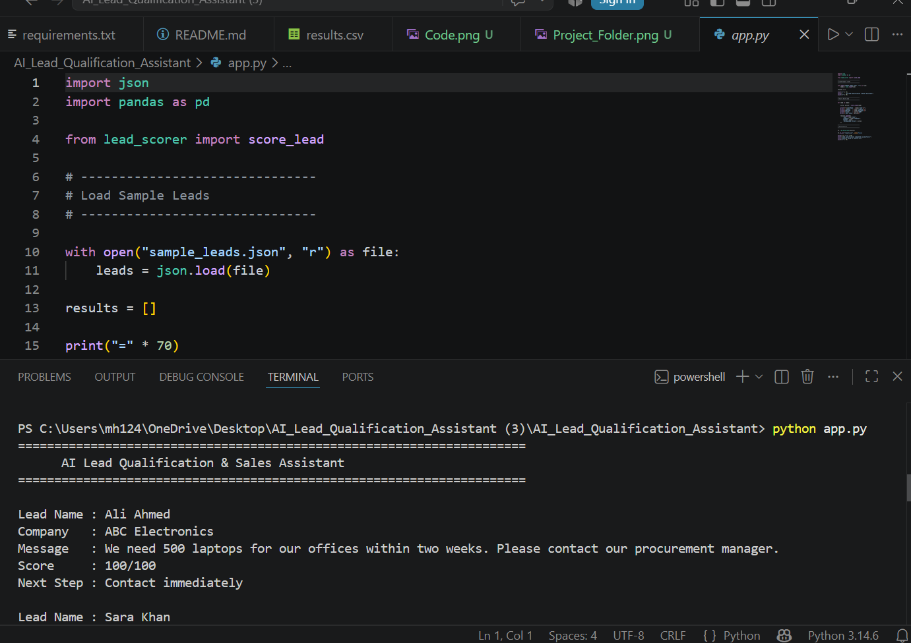
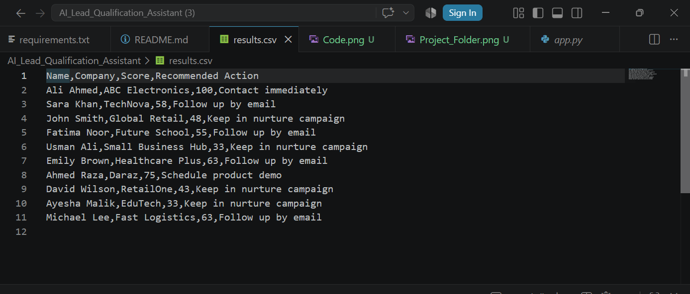
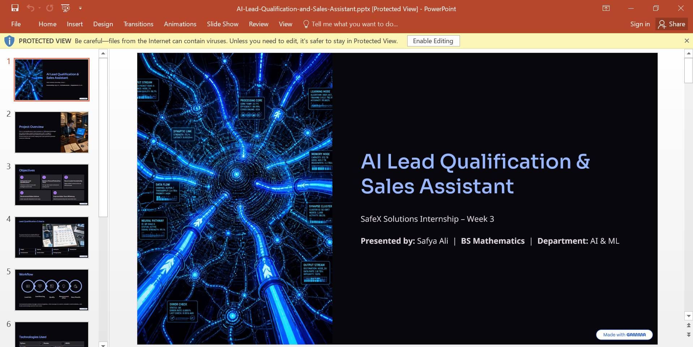
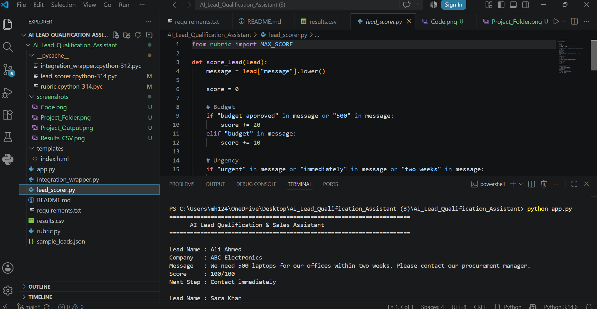

# 🤖 AI Lead Qualification & Sales Assistant

<p align="center">
  
  
  
  
  
  
</p>

---

# 📌 Project Overview

This project was developed as part of the **SafeX Solutions AI & ML Internship – Week 3**.

The **AI Lead Qualification & Sales Assistant** automatically evaluates inbound sales leads by analyzing customer information and assigning a **qualification score (0–100)** along with a recommended **next sales action**.

The project demonstrates how AI-assisted lead qualification can help businesses prioritize high-value leads, improve response times, and support better sales decision-making.

---

# 🎯 Project Objectives

- Automatically evaluate inbound sales leads.
- Score leads using predefined qualification criteria.
- Recommend the next action for the sales team.
- Demonstrate AI-based business process automation.

---

# ✨ Features

- ✅ Lead qualification scoring (0–100)
- ✅ 7 predefined qualification criteria
- ✅ Automatic next-action recommendation
- ✅ Tested using 10 sample leads
- ✅ Results exported to CSV
- ✅ Integration-ready using `integration_wrapper.py`

---

# 📊 Qualification Criteria

| Criterion | Maximum Score |
|-----------|--------------:|
| 💰 Budget | 20 |
| ⏰ Urgency | 15 |
| 🏢 Industry Fit | 15 |
| 📈 Company Size | 15 |
| 🛒 Purchase Intent | 15 |
| 👤 Decision Maker | 10 |
| 📝 Message Quality | 10 |

### ⭐ Maximum Score: **100**

---

# 📂 Project Structure

```text
AI_Lead_Qualification_Assistant/
│
├── app.py
├── lead_scorer.py
├── rubric.py
├── sample_leads.json
├── results.csv
├── integration_wrapper.py
├── requirements.txt
├── README.md
├── templates/
└── screenshots/
```

---

# 📥 Input

The system accepts:

- Lead Name
- Company Name
- Customer Message

---

# 📤 Output

The system generates:

- Qualification Score (0–100)
- Recommended Next Action

### Possible Actions

- 📞 Contact Immediately
- 📅 Schedule Product Demo
- 📧 Follow Up by Email
- 🌱 Keep in Nurture Campaign

---

# 🛠 Technologies Used

- 🐍 Python
- 📊 Pandas
- 📄 JSON
- ⚡ FastAPI (Integration Layer)
- 💻 VS Code
- 🌐 Git & GitHub

---

# ▶ How to Run

### Install Dependencies

```bash
pip install -r requirements.txt
```

### Run the Project

```bash
python app.py
```

---

# 📄 Sample Output

```text
Lead Name : Ali Ahmed
Company   : ABC Electronics

Score     : 100/100

Next Step : Contact Immediately
```

---

# 📸 Project Screenshots

## 📁 Project Folder



---

## 💻 Source Code



---

## ▶ Project Output



---

## 📄 Results CSV



---

## 🌐 GitHub Repository


---

## 📊 Presentation



---

## 🚀 Project Demo



---

# 🏢 Internship Information

| Item | Details |
|------|---------|
| Organization | SafeX Solutions |
| Department | AI & ML |
| Internship | Week 3 |
| Project | AI Lead Qualification & Sales Assistant |

---

# 👩‍💻 Developer

**Safya Ali**

🎓 BS Mathematics

📊 Data Science & AI Enthusiast

💼 SafeX Solutions AI & ML Intern

---

## ⭐ If you found this project helpful, consider giving it a star on GitHub!